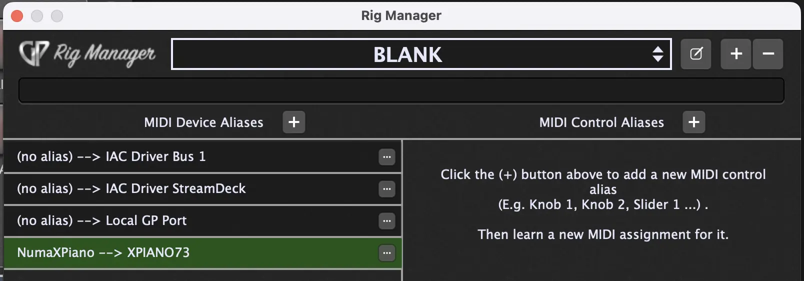
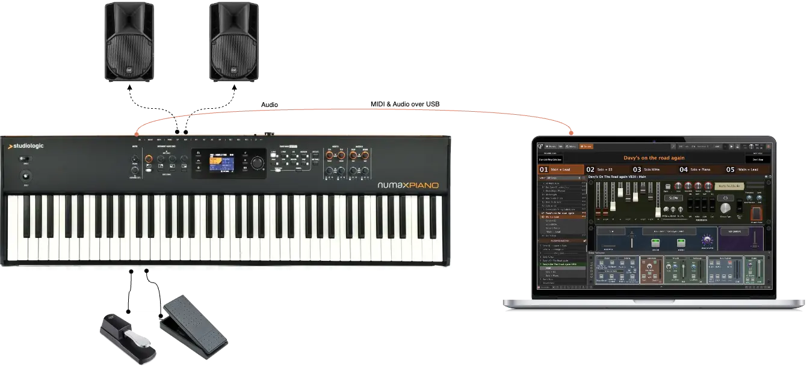
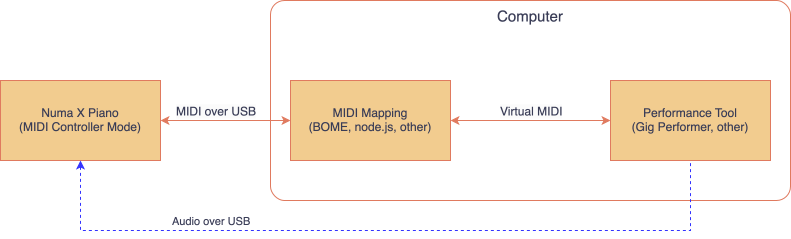
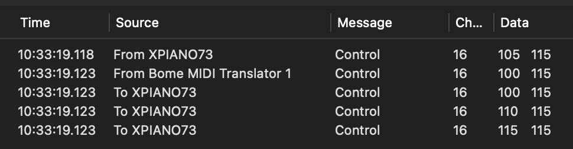

# MIDI Mapper for Numa X Piano

Github: [https://github.com/musios-app/numaxpiano-midi-controller](https://github.com/musios-app/numaxpiano-midi-controller)
 
Licence: [Creative Commons CC0 1.0 Universal](../LICENSE)
 
Author: Andrew Hunt [musios.app](https://musios.app)
 
Status: Work in Progress

    
WORK IN PROGRESS

    
The algrotihm below is implemented and tested in a gig. It works 😀

    
I need a week or two to:

    <ul>
        <li>Get the Bome implementation documented and published</li>
        <li>Clean up the node.js version and try to address latency</li>
        <li>Clean up this page and get the "Download and Use It" part to the top</li>
    </ul>

## Tested environments

<table class="numa-cc-map table-all-lines" style="margin: 8px; border: solid 1px grey;">
    <thead>
        <tr>
            <th>System</th>
            <th>Fully Tested</th>
            <th>Positive Reports</th>
            <th>Issues Reported</th>
        </tr>
    </thead>
    <tbody>
        <tr>
            <td>Keyboard</td>
            <td>Studiologic NUMA X Piano 73 (firmware 2.4.0)</td>
            <td></td>
            <td></td>
        </tr>
        <tr>
            <td>Operating system</td>
            <td>MacOS Sequoia 15.3</td>
            <td></td>
            <td></td>
        </tr>
        <tr>
            <td>Other Software</td>
            <td>
                Gig Performer 5 (v5.0.28)
                 
                Bome MIDI Translator Pro (v.1.9.1)
                 
                Node.JS (v22.12.0)
            </td>
            <td></td>
            <td></td>
        </tr>
    </tbody>
</table>

## Using the BOME Mapper for Numa X Piano

## Gig Performer - full controller

<a href="Gig Files/Studiologic NUMA X Piano.gig">
     
    Download Studiologic NUMA X Piano.gig
</a>

This is demo-only self-contained Gig Performer gig file that showcases most of the MIDI controls available with the Numa X Pianos. The reason there are so many more knobs and buttons in this view compared to a real, physical Numa X Piano is that the controls on the piano behave differently when different Zones and Parameters are selected. Read the full page for the detail.

There is an Instructions rackspace with the steps to put this to use. It describes the implementation of Sync (to keep the Numa X and GP setup synchronised) but also the limits on this sync.

Do I use this?  No. Except that it was a helpful step in exploring how to connect a Numa X and Gig Performer. The primary lesson was that a Mapping Proxy was a better solution.

*NOTE on GP:* the Gig Script maps incoming MIDI values for buttons from Numa-X values to GP-style values (GP is more conventional I think).  I could not find a way in GP to re-map those values for return to the NumaX. If it's possible, [please let me know](https://github.com/musios-app/numaxpiano-midi-controller/issues).  [I did it with OSC messages but it was complex, difficult to maintain, and not something I wanted to make available.]

    
    <figcaption class="figure-caption text-center">Rackspace with full set of MIDI Controller knobs and buttons</figcaption>

This is what your Rig Manager should look like:

    
    <figcaption class="figure-caption text-center">Sample: Rig Manager for Studiologic NUMA X Piano.gig</figcaption>

## Overview

**(For me) Main issues with Numa X Piano as a MIDI Controller is there's too much to think about and go wrong live**

* Many of the control knobs send different CC numbers depending upon the zone selected (1-4) and/or the parameter number selected (1-3)
* Changing the zone, muting an instrument and other action can cause unexpected jumps in the knob value
* Changes to CC values by the Performance Tool (Gig Performer, Mainstage etc) do not sync reliably whoch also causes unexpected jumps in the knob value

**My goal with this project is a simpler, smoother experience playing the Numa X Piano as a controller**

* Each knob press or knob rotation delivers the same MIDI CC number and does this no matter the zone selection and parameter selection
* Changes to those same knob press or knob rotation values by the performance tool apply across the different states of the Numa X
* Knobs that do other things apart from send/receieve MIDI can be ignored/deferred for this work

**In this project:**

1. An algorithm for a "MIDI Mapper" that makes one controller = one MIDI CC
2. Implementation in [Bome MIDI Translator Pro](https://www.bome.com/products/miditranslator) (paid software which a free trial)
3. Implementation in NodeJS / Javascript (functional but too much latency for live keys)
4. A configurable ["Rig Setup" generator for the Numa X Piano](gen-numaxpiano-gp-rigsetup/README.html)

## Basic Rig

The basic rig used for development and testing:

* Studiologic Numa X Piano 73 (73  keys) as a MIDI controller
* Sustain and expression pedals (sometimes via a BOSS FA-1-BL footswitch to MIDI IN)
* Mac running MacOS Sequoia 15.2 (Mac Mini M4 with 24GB memory, 2TB SSD - a grunty host!) with an Espress touch screen
* Gig Performer 5.x as the Performance Tool using a variety of plugin instruments and effects
* Studiologic Numa X Piano 73 (73  keys) also used as the USB audio device for output

[Yes, the picture shows a Macbook. It's been tested on that too.]

    
    <figcaption class="figure-caption text-center">Basic Rig</figcaption>

## Enable MIDI Controller Mode

The "Local Control" settings puts the Numa X Piano into a MIDI Controller Mode. 
(There are other settings but they are not needed for the simplest setup.)

1. Click the gear button (⚙️) to open Numa's Global Settings
2. Turn "Local Control" to "OFF"
3. Set the Common Channel (I use 1 or 16)

    
    <figcaption class="figure-caption text-center">Global Setting for Local Control</figcaption>

## Numa X Controllers (the knobs)

A "Controller" is a physical control. It's device with buttons, knobs, modulation wheel etc. For the Numa X, most of the knob are dual function - with both rotation and press - so one knob is effectively 2 controls.

In this stage in the project, we focus on two groups of controls that trigger MIDI events. The group do not have side-effects in controller mode. A side-effect would be sending MIDI CC values .. AND making some other kind of change to the keyboard.

1. Instrument Knobs (left side)
2. Effects Controls (right side) 

    
    <figcaption class="figure-caption text-center">MIDI Controller knobs and buttons</figcaption>

### Instrument Knobs Group

When Local Mode is ON, these 4 knobs control the 4 layers of the current Program. However, the 4 rectangular "Select [Zoom]" buttons do not have corresponding MIDI controls.

These images show the physical controls on the Numa X Piano (left) and the corresponding logical MIDI Controls (right).

    

        
        <figcaption class="figure-caption text-center">Physical Instrument Controls</figcaption>
    

    

        
        <figcaption class="figure-caption text-center">Logical Instrument Controls</figcaption>
    

For MIDI CC, the **rotation** of these 4 knobs does not need mapping because rotation always sends the same MIDI CC number for rotation and the behvaiour is not affected by Zone selection or other state. The value sent is `0-127` which is convention.

For MIDI CC, the **press** of these 4 knobs is consistent with a single MIDI CC number per knob press. However, we'll map the CC values (for on/off/mute) to deliver conventional on/off values (details below)

Notes: The square white Select / Zoom buttons below do not generate MIDI CC values. However, the change Zone selection which triggers the Zone On/Off/Mute as if from pressing all 4 zone buttons. These MIDI messages are mapped as if sent in response to button pressed.

This image is a screenshot of a Gig Performer rackspace with the 4 knobs mapped to the 8 logical controls. Left to right are controls for zones 1..4 and each has a dial for rotation and an on/off button for the zone enable. The MIDI CC numbers are shown in the circles.
The image shows the 4 rotation and 4 press controls with their MIDI CC number.

### FX A and FX B Groups

FX-A and FX-B each have 2 press/rotation knobs. The behavior is the same for FX-A and FX-B except that they have different MIDI Control numbers and have different sets of effects.

    

        

            
            <figcaption class="figure-caption text-center">FX-A Physical Controls</figcaption>
        

        

            
            <figcaption class="figure-caption text-center">FX-A Logical MIDI Controls</figcaption>
        

        

            
            <figcaption class="figure-caption text-center">Goal: FX-A Logical MIDI Controls</figcaption>
        

    

The top knob labelled "Amount" has rotation and press. Importantly, both control different MIDI CC numbers depending upon which Zone is selected in the Instrument pane.

1. Top knob rotation to adjust the level of the the effect
2. Top knob press to turn on/off the effect

The logical diagram (center) shows this as 4 different logical knobs and on/off buttons with a pair for Zone 1, 2, 3, 4. Each has a different MIDI CC number.

For example, if the piano has Zone 2 selected, then rotating the FA-X Amount knob sending CC #73. If you select zone 3, then it sends CC #78.

The logical diagram at right shows the goal with a single CC number irrespective of the selected Zone (at least, this is my preference).

The bottom FX-A knob is for parameter settings (e.g. change the EQ parameter for Low). There are 3 parameters that can be controlled via the knob. Rotation changes the setting and sends a MIDI CC. Pressing the knob switches between the 3 params but does not send any MIDI.

The MIDI sent on rotation is different for each Zone (1..4) and for each parameter number (1..3). That's 12 different CC numbers from the same physical rotation!  These shown ny the 12 buttons in the logical diagram at the intersections of the Zone and Parameter box.  e.g. Rotating the FX-A parameter when Zone 2 and Parameter 3 are selected will send MIDI CC #77.

The goal for this setting is show in the right diagram.  

1. Rotating the FX-A Amount knob will always send MIDI CC #68 (as if Zone 1 is enabled). The value is `0-127` and does not need mapping.
2. Pressing the FX-A Amount press will always send MIDI CC #69 (as if Zone 1 is enabled). (More on the value mapping below)
3. Pressing the FX-A Parameter knob will always send MIDI CC #70 (as if Zone 1 and Parameter 1 are selected). The value is `0-127` and does not need mapping.

The value of the press function is a little tricky to work with because a change in value will affect the instrument sound when we return to playing the Numa X sounds in local mode.

[Aside: the goal is for the selected FX to be unchanged when using the control mode. This requires the mapping proxy to retain memory of the effect setting of each Zone and maintain that when enabling and disabling. I just haven't done it becauses my preferred solution is to have a dedicated Program in which the Local zones can be changed. Just saved time and hassle!]

FX-A Effect Selection (MIDI CC #69, 74, 79, 84 for Zones 1..4)

| Effect | CC Value |
| -- | ------ |
| OFF | 0 | 
| Distortion | 48 | 
| Overdrive | 49 |
| Warm Drive | 50
| Auto Wah | 56 |
| Pedal Wah | 57 |
| LFO Wah | 58 |
| Auto Pan | 33 | 
| Tremolo | 32 |
| Vibrato | 80 |
| Equalizer | 64 | 
| Compressor | 88 |

As mentioned, the design for the FX-B control groups is the same except that the MIDI CC and values are different.

    

        
        <figcaption class="figure-caption text-center">FX-B Physical Controls</figcaption>
    

    

        
        <figcaption class="figure-caption text-center">FX-B Logical MIDI Controls</figcaption>
    

    

        
        <figcaption class="figure-caption text-center">Goal: FX-B Logical MIDI Controls</figcaption>
    

FX-B Effect Selection (MIDI CC #100, 105, 110, 105 for Zones 1..4)

| Effect | CC Value |
| -- | ------ |
| OFF | 0 | 
| Chorus1 | 8 |
| Chorus2 | 9 |
| Flanger1 | 16 |
| Flanger2 | 17 |
| Phaser100 | 24 | 
| Phaser90 | 25 |
| PhaserHmx | 26 | 
| PhaserPad | 27 |
| Rotary | 40 |
| Auto Wah | 56 | 
| Pedal Wah | 57 | 
| LFO Wah | 58 |
| Auto Pan | 33 | 
| Tremolo | 32 |
| Vibrato | 80 |
| Equalizer | 64 |

### Delay and Reverb

The Delay and Reverb controls look like the FX A and FX B controls but behave somewhat differently.

1. The press control for Delay and Reverb has the effect of settings the level to 0 (Off) then returning the current level setting. The value is sent with the same MIDI CC number as the rotation.
2. Rotation the Delay and Reverb level while the setting is 0 (Off) changes the internal value but no MIDI CC is sent
3. The CC number for Delay and Reverb level are affected by the Zone selection.
4. The Parameter rotation CC numbers are affected by the Parameter selection (separately for Delay and Reverb) but are not affected by the Zone seletion.

    
    
    <figcaption class="figure-caption text-center">Delay and Reverb Controls</figcaption>

### Deferred Controls

I did not include these Numa X control because of the side-effects. That is, when they are used as MIDI controls they **also** have another effect such as change volume, or changing instrument setup, or other effect that might be unexpected or undesirable.

**Assignable knob**: rotating this knob sends MIDI CC but also changes the USB audio volume. These 2 controls can't be distinguished so I choose not to use the Assignable knob to  avoid volume issues.

**Main dial and Sound Bank / Favourites**:  
These controls send MIDI message like Program Change (PC). Because of the risk of side effects, I don't use them for MIDI control.

### Pass-Through

All other MIDI can can passed through unchanged. They are not affected by the state of the Numa X. We do need to test to ensure the mapper passes them through so that nothing is broken. Examples from the NUMA X MIDI specification.

1. The piano keybed: note on/off, channel pressure
2. The modulation and XY controller (dedicated CC numbers)
3. The pedal and expression controllers (if connected)
4. MIDI IN

## The Problem

So I'm playing a song with both rock organ and piano parts. I'm using plugins within Gig Performer to provide those sounds. I have the Zone 1 knob rotation controlling the volume of the organ and the Zone 1 press for mute/unmute.  It's the same for the piano except it's Zone 2. I have expression pedal and sustain pedal for drive and sustain.  

All is good as I start off playing the organ.

But I'm also using FX A knob to control effects within Gig Performer. When Zone 1 is selected the Numa sends FX A rotation as MIDI CC 68 (x44).  I switch from organ to piano by pressing Zone 1 (to mute) and Zone 2 (to unmute).  Now, FX A rotation is sent as MIDI CC 73 (x49).  

Worse, it has a different value which meanns a small rotation can cause a big jump in the CC number which causes my effects to go crazy.

Worse, when I switch songs or patches on the computer it sends a MIDI CC to 68 but that doesn't affect 73, 78 or 83 which are CC numbers for Zone 2, 3 and 4. After this a change in Zone zoom can cause big jumps in the CC numbers which also causes my effects to go crazy.

**To be clear,** this is _my_ preference for how I want a MIDI controller to operate. There may be reasons and circumstances in which the native behavior is your preference. You don't need a mapper so play on 😎.

## The Solution - The MIDI Mapper

The solution is a general "algorithm" whcih can be implemented many ways. The ones I implemented and document are:

1. **Node.js / Javascript**: Functional but had latency issues that affected the notes (but didn't matter for the controllers)
2. **[Bome MIDI Translator Pro](https://www.bome.com/products/miditranslator)**: paid software which a free trial. This is what I am using at time of writing
3. **MIDI Mapping in Gig Performer**: I could map messages coming from the keyboard to GP but the mapping of return messages was complex and messy. (I might try again another day.)

All implementation support these requirements:

| # | Requirement | What the mapper does | Detail |
|-----------------|-----------------|-----------------|-----------------|
| 1    | The performance software will not need to deal with the Zones and Parameter variation. | Map all MIDI variations from a knob press or rotation to a single MIDI CC | I use the MIDI CC for Zone 1 & param 1 for consistency |
| 2    | Changes to a knob's value (press or rotate) will be updated for all zone & parameter variation of that same knob  | A change to press or rotation on a knob will be instantly be passed back for all Zone and Parameter variations of that same knob | - |
| 3    | MIDI CC from the performance software to the Numa must affect all variations   | A MIDI CC must be mapped to all zone and parameter variations at the same time   | - |

The Mapper* provides a live translation between (a) the MIDI from the Numa X Piano which comes over USB (or a MIDI cable), and (b) the "Virtual MIDI" which our required MIDI. 

(Technically, it could be called a re-write proxy.)

    
    <figcaption class="figure-caption text-center">Logical Design</figcaption>

### Mini-MIDI Specification for NUMA X Piano in MIDI Controller Mode

This change shows the MIDI CC (continuous controller) messages associated with Instrument Knobs and with the Effects Knobs. We are interested in both mapping and translation of MIDI CC Numbers and MIDI CC Values.

Studiologic's official [Numa X MIDI specification](https://www.studiologic-music.com/support/numaxpiano/Numa_X_Piano_MIDI_implementation_chart.pdf) is the "source of truth" on these MIDI messages.   We're interested in the subset of the Control Channel in the section on "CC table Common Channel" starting from page 4 (it's not obviuos!)  The first 5 columns in the table below match the CC numbers from the 
[Numa X MIDI specification](https://www.studiologic-music.com/support/numaxpiano/Numa_X_Piano_MIDI_implementation_chart.pdf).

The cells with the highlights are the ones that require mapping to or from the Numa X Piano.  For knobs that have different MIDI CC Numbers (depending upon the current Zone selection and/or paarameter selection), the single "representative" CC number is highlighted. It is the CC number for Zone 1 and/or parameter 1.

The cells also correspond to the MIDI CC numbers in the controller images above.

<table class="numa-cc-map" style="margin: 8px; border: solid 1px grey;">
    <thead>
        <tr>
            <th>Group</th>
            <th>Controller</th>
            <th>Action</th>
            <th>CC Number (Group)</th>
            <th>CC Value</th>
            <th>CC Number (Single)</th>
            <th>CC Value Map</th>
            <th>Note</th>
        </tr>
    </thead>
    <tbody>
        <tr>
            <td>Assignable</td>
            <td>Assignable</td>
            <td>Rotate</td>
            <td>3</td>
            <td>0 - 127</td>
            <td>pass</td>
            <td>pass</td>
            <td></td>
        </tr>
        <tr>
            <td></td>
            <td></td>
            <td>Press</td>
            <td>-</td>
            <td>-</td>
            <td>-</td>
            <td>-</td>
            <td>(a)</td>
        </tr>
        <!-- Instrument Knobs -->
        <tr>
            <td>Instrument Knobs</td>
            <td>Zone 1</td>
            <td>Rotate</td>
            <td>33</td>
            <td>0 - 127</td>
            <td>pass</td>
            <td>pass</td>
            <td></td>
        </tr>
        <tr>
            <td></td>
            <td>Zone 2</td>
            <td>Rotate</td>
            <td>34</td>
            <td>0 - 127</td>
            <td>pass</td>
            <td>pass</td>
            <td></td>
        </tr>
        <tr>
            <td></td>
            <td>Zone 3</td>
            <td>Rotate</td>
            <td>35</td>
            <td>0 - 127</td>
            <td>pass</td>
            <td>pass</td>
            <td></td>
        </tr>
        <tr>
            <td></td>
            <td>Zone 4</td>
            <td>Rotate</td>
            <td>36</td>
            <td>0 - 127</td>
            <td>pass</td>
            <td>pass</td>
            <td></td>
        </tr>
        <tr>
            <td></td>
            <td>Zone 1</td>
            <td>Press</td>
            <td>12</td>
            <td class="value-map">Off=0  On=1   Mute=2</td>
            <td>pass</td>
            <td class="value-map">On=127  Off/Mute=0 </td>
            <td>(b, c)</td>
        </tr>
        <tr>
            <td></td>
            <td>Zone 2</td>
            <td>Press</td>
            <td>13</td>
            <td class="value-map">Off=0  On=1   Mute=2</td>
            <td>pass</td>
            <td class="value-map">On=127  Off/Mute=0 </td>
            <td>(b, c)</td>
        </tr>
        <tr>
            <td></td>
            <td>Zone 3</td>
            <td>Press</td>
            <td>14</td>
            <td class="value-map">Off=0  On=1   Mute=2</td>
            <td>pass</td>
            <td class="value-map">On=127  Off/Mute=0 </td>
            <td>(b, c)</td>
        </tr>
        <tr>
            <td></td>
            <td>Zone 4</td>
            <td>Press</td>
            <td>15</td>
            <td class="value-map">Off=0  On=1   Mute=2</td>
            <td>pass</td>
            <td class="value-map">On=127  Off/Mute=0 </td>
            <td>(b, c)</td>
        </tr>
        <!-- FX Knobs (top row) -->
        <tr>
            <td>FX Knobs (top row)</td>
            <td>FX A</td>
            <td>Rotate</td>
            <td class="number-map">68, 73, 78, 83</td>
            <td>0 - 127</td>
            <td class="number-map">68</td>
            <td>pass</td>
            <td></td>
        </tr>
        <tr>
            <td></td>
            <td>FX B</td>
            <td>Rotate</td>
            <td class="number-map">100, 105, 110, 115</td>
            <td>0 - 127</td>
            <td class="number-map">100</td>
            <td>pass</td>
            <td></td>
        </tr>
        <tr>
            <td></td>
            <td>Delay</td>
            <td>Rotate</td>
            <td class="number-map">24, 25, 26, 27</td>
            <td>0 - 127</td>
            <td class="number-map">24</td>
            <td>pass</td>
            <td></td>
        </tr>
        <tr>
            <td></td>
            <td>Reverb</td>
            <td>Rotate</td>
            <td class="number-map">28, 29, 30, 31</td>
            <td>0 - 127</td>
            <td class="number-map">28</td>
            <td>pass</td>
            <td></td>
        </tr>
        <tr>
            <td></td>
            <td>FX A</td>
            <td>Press</td>
            <td class="number-map">69, 74, 79, 84</td>
            <td class="value-map">On > 0   Off=0 </td>
            <td class="number-map">69</td>
            <td class="value-map">On=127 Off=0</td>
            <td>(d)</td>
        </tr>
        <tr>
            <td></td>
            <td>FX B</td>
            <td>Press</td>
            <td class="number-map">101, 106, 111, 116</td>
            <td class="value-map">On > 0   Off=0</td>
            <td class="number-map">101</td>
            <td class="value-map">On=127 Off=0</td>
            <td>(d)</td>
        </tr>
        <tr>
            <td></td>
            <td>Delay</td>
            <td>Press</td>
            <td>-</td>
            <td>-</td>
            <td>-</td>
            <td>-</td>
            <td>(a)</td>
        </tr>
        <tr>
            <td></td>
            <td>Reverb</td>
            <td>Press</td>
            <td>-</td>
            <td>-</td>
            <td>-</td>
            <td>-</td>
            <td>(a)</td>
        </tr>
        <!-- FX Knobs (parameter row) -->
        <tr>
            <td>FX Knobs (parameter row)</td>
            <td>FX A Param</td>
            <td>Rotate</td>
            <td class="number-map">
                70, 75, 80, 85,  
                71, 76, 81, 86,  
                72, 77, 82, 87
            </td>
            <td>0 - 127</td>
            <td class="number-map">70</td>
            <td>pass</td>
            <td></td>
        </tr>
        <tr>
            <td></td>
            <td>FX B</td>
            <td>Rotate</td>
            <td class="number-map">
                102, 107, 112, 117,  
                103, 108, 113, 118,  
                104, 109, 114, 119
            </td>
            <td>0 - 127</td>
            <td class="number-map">102</td>
            <td>pass</td>
            <td></td>
        </tr>
        <tr>
            <td></td>
            <td>Delay</td>
            <td>Rotate</td>
            <td class="number-map">57, 58, 59</td>
            <td>0 - 127</td>
            <td class="number-map">57</td>
            <td>pass</td>
            <td></td>
        </tr>
        <tr>
            <td></td>
            <td>Reverb</td>
            <td>Rotate</td>
            <td class="number-map">61, 62, 63</td>
            <td>0 - 127</td>
            <td class="number-map">61</td>
            <td>pass</td>
            <td></td>
        </tr>
        <tr>
            <td></td>
            <td>FX A</td>
            <td>Press</td>
            <td>-</td>
            <td>-</td>
            <td>-</td>
            <td>-</td>
            <td>(a)</td>
        </tr>
        <tr>
            <td></td>
            <td>FX B</td>
            <td>Press</td>
            <td>-</td>
            <td>-</td>
            <td>-</td>
            <td>-</td>
            <td>(a)</td>
        </tr>
        <tr>
            <td></td>
            <td>Delay</td>
            <td>Press</td>
            <td>-</td>
            <td>-</td>
            <td>-</td>
            <td>-</td>
            <td>(a)</td>
        </tr>
        <tr>
            <td></td>
            <td>Reverb</td>
            <td>Press</td>
            <td>-</td>
            <td>-</td>
            <td>-</td>
            <td>-</td>
            <td>(a)</td>
        </tr>
    </tbody>
</table>

**Table Notes**

(a) No MIDI CC message for pressing this knob.

(b) Most MIDI on/off values are On=127 (or >= 64) and Off=0 (or <64) but Numa X does On=1 and Off=2. If, however, you are mapping to a mute or bypass contoller in the performance tool then the value needs to be inverted. For CC messages back to the Numa X the CC values must be exactly 2 or 1.

(c) Long press sets the zone to solo (value=2) with the other zones off (value=1). That's 4 MIDI control messages in quick sequence.

(d) The value from the Numa X is 0 for  press to "Off"
 and non-zero for press to "On". Specifically, the number is the setting for the FX (e.g. FX A Overdrive=49). In MIDI Controller mode we need On=127 and Off=0. 

### MIDI mapping alogrithm for messages from Numa X

This sequence shows the MIDI messages fired by the Mapper in response to a CC event from Numa X.

1. Numa X piano sends a MIDI message which is received by the MIDI Mapper
2. If it is a CC message in one of the groups from table then
   1. Send forward a CC message as-if the Numa X had Zone 1 selected and Parameter 1 for all effects (first in group by design)
      1. CC channel unchanged
      2. CC number is the first CC number in the group
      3. See the mapping for translating the CC value (usually unchanged)
   2. For each CC number in the group (except the CC number received) send multiple MIDI CC messages back to the Numa X with
      1. CC channel unchanged
      2. Each CC number from the group (except the CC number received)
      3. CC value unchanged
3. Otherwise, for all other MIDI messages (including CC numbers not shown in the table) pass them forward without change.

    
    <figcaption class="figure-caption text-center">Sequence Diagram for MIDI Messages from Numa X Piano</figcaption>

## MIDI mapping algorithm for messages from the Performance Tool to Numa X

1. Performance tool sends MIDI message which is receive by the MIDI Mapper.
2. If it is a CC message in one of the groups from table then for every CC number in the group send a CC message to the Numa X with:
   1. CC channel unchanged
   2. CC number from the group
   3. CC valie unchanged
3. Otherwise, for all other MIDI messages (including CC numbers not shown in the table) pass them on without change.

    
    <figcaption class="figure-caption text-center">Sequence Diagram for MIDI Messages from the Performance Tool</figcaption>

### Example for FX B Rotation

The player turns the FX B Effects level knob...

    
    <figcaption class="figure-caption text-center">MIDI Messages for FX B rotation</figcaption>

If the piano has Zone 2 selected, the Numa X will send MIDI CC number 105 (x60). For Zones 1, 3, 4 the MIDI numbers are 100, 110, 115.  We need the mapper to:

1. Receive the MIDI CC with numer 105
2. Send forward that CC value to the performance tool as CC number 100 (x64)
3. And, send back the value as the other 3 CC numbers from 100, 110 and 115 so that the knob has the same value across all Zones (in case the player changes Zone)

This MIDI log (by the MIDI Monitor app) shows this sequence. In this case it the BOME implementation. Note that it takes only 5msec for the mapping to complete which is entirely satisfactory for a non-time-sensitive parameter change (knob rotation).

    
    <figcaption class="figure-caption text-center">MIDI Monitor capture FX B rotation messages</figcaption>

## Implementation with BOME MIDI Translator Pro

<a href="https://www.bome.com/products/miditranslator">Bome MIDI Translator Pro</a> is a paid product. I am using it because it is built for this kind of MIDI mapping and it performs with low latency.

    NOTE: It's working and I've used it in rehearsals. Some minor issues to sort out then publish.

    Check the `javascript` directory in the <a href="https://github.com/musios-app/numaxpiano-midi-controller">numaxpiano-midi-controller</a> for the JS source to convert the algorithm to a BOME script. I need to get the full BOME script finalised.

## Implementation with NodeJS / JavaScript

    NOTE: This implementation is functional but has noticeable latency on pass-through of MIDI messages making playing keys. It was about 15-20msec but I didn't do proper measurement or determine the specific source of the latency.

A rough measurement with MIDI Monitor showed delays around 20msec (unsatisfactory is above 2-5msaec).
It might be possible to interface directly to the Node Task Queue to reduce that latency
A task queue is a mechanism that helps in organizing and executing tasks in a prioritized manner. 
The `process.nextTick()` could prioritize sending of MIDI messages. This matters most of NoteOn/NoteOff messages but maintain

Notes: 
* This is a work in progress. The Studiologic doc is sparse so there may be errors. Please submit comments in [issues page on the Github project](https://github.com/andrewjhunt/numaxpiano-midi-controller).
* The documentation and images is from a NUMA X Piano 73. It is likely that the 88 and 88 HD will be similar but this needs to be confirmed. Unfortunately, I have no idea about the Compact series. Use the issues or submit a pull request if you can help.
* This work was done on a Mac. It shouldn't be that different for Windows or Linux.

## Numa X Docs

All the relevant Numa X documentation that I could find is on the **[Numa X Piano support page](https://www.studiologic-music.com/support/numaxpiano/)** including:

* [User Manual for Numa X Piano](https://www.studiologic-music.com/support/numaxpiano/Numa_X_Piano_Manual_EN.pdf)
* [numaXPiano MIDI Chart](https://www.studiologic-music.com/support/numaxpiano/Numa_X_Piano_MIDI_implementation_chart.pdf)

## Verifying MIDI Messages

Install a MIDI monitor on your computer to verify that the NUMA X Piano is sending MIDI messages.

For Mac, I use [MIDI Monitor](https://www.snoize.com/MIDIMonitor/). There are many alternatives.

First, verify connectivity by playing some notes on the keyboard. You should see Note On/Off MIDI messages in the monitor. If not, check your cabling and MIDI settings.

Now, turn the Zone 1 knob. You should see CC messages in the monitor. Specifically, the CC number should match the Knob 1 CC setting in the Program settings for Zone 1 (it's CC 22 in the image above).  If not, check that the configuration is completed.
